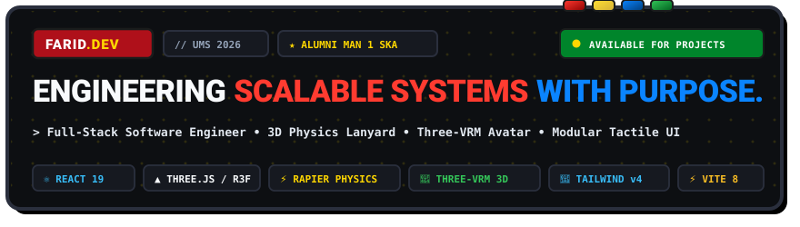

<div align="center">

  <!-- Custom Lego Neo-Brutalist Vector Banner -->
  

  <br/><br/>

  <!-- Stud Bar Accent -->
  <p align="center">
    <code>🔴 🟡 🔵 🟢 &nbsp; // MODULAR TACTILE SYSTEM &bull; LEGO NEO-BRUTALISM // &nbsp; 🟢 🔵 🟡 🔴</code>
  </p>

  <!-- Tactile Lego Brick Badges -->
  <p align="center">
    <a href="https://github.com/faridmarufprabowo2021">
      
    </a>
    &nbsp;
    <a href="#01--identity--academic-background">
      
    </a>
    &nbsp;
    <a href="#01--identity--academic-background">
      
    </a>
    &nbsp;
    <a href="https://react.dev/">
      
    </a>
  </p>

  <p align="center">
    <b>Farid Ma'ruf Prabowo</b> &bull; Full-Stack Software Engineer &bull; AI & 3D Web Systems Developer<br/>
    <i>Universitas Muhammadiyah Surakarta (UMS 2026) &bull; Alumni MAN 1 Surakarta</i>
  </p>

</div>

---

> ### 🧱 THE LEGO METAPHOR IN CODE
> *"Membangun perangkat lunak dengan pendekatan modular dan presisi seperti balok LEGO. Bagi saya, perangkat lunak yang hebat bukan hanya yang sekadar berfungsi, melainkan yang dibangun dengan arsitektur modular yang bersih, performa tangguh, dan siap dikembangkan ke masa depan."*  
> &mdash; **Farid Ma'ruf Prabowo**

---

## 🧭 Navigation & Section Index

- [01 // Identity & Academic Background](#01--identity--academic-background)
- [02 // Technical Arsenal // Toolbox (BrickBox)](#02--technical-arsenal--toolbox-brickbox)
- [03 // 3D Interactive Highlights (Lanyard & VRM)](#03--3d-interactive-highlights-lanyard--vrm)
- [04 // Featured Works & Architecture Case Studies](#04--featured-works--architecture-case-studies)
- [05 // Track Record & Positions (Experience)](#05--track-record--positions-experience)
- [06 // Credentials & Certifications](#06--credentials--certifications)
- [07 // Transmission // Get in Touch](#07--transmission--get-in-touch)
- [08 // Engineering Architecture & Local Setup](#08--engineering-architecture--local-setup)

---

## 01 // Identity & Academic Background

```typescript
const developerProfile: DeveloperIdentity = {
  name: "Farid Ma'ruf Prabowo",
  shortName: "Farid",
  brand: "FARID.DEV // UMS 2026",
  role: "Full-Stack Engineer & AI Developer",
  university: "Universitas Muhammadiyah Surakarta (UMS)",
  academicTrack: "S1 Teknik Informatika (Informatics Engineering) — Batch 2026",
  highSchoolOrigin: "MAN 1 Surakarta (Madrasah Aliyah Negeri 1 Surakarta)",
  location: "Surakarta / Solo, Jawa Tengah, Indonesia",
  status: "AVAILABLE FOR COLLABORATION & PROJECTS"
};
```

### 📊 Academic & Engineering Metrics

| Metric Dimension | Key Indicator | Architecture Role & Focus |
| :--- | :--- | :--- |
| 🎓 **ACADEMIC TRACK** | **UMS '26** | S1 Teknik Informatika UMS (Freshman). Fokus pada Rekayasa Perangkat Lunak, Sistem Terdistribusi, dan Kecerdasan Buatan. |
| 🏛️ **ALUMNI ORIGIN** | **MAN 1 SKA** | Alumni MAN 1 Surakarta dengan spesialisasi peminatan sains, matematika komputasi, dan logika robotika. |
| 🚀 **PRODUCTION APPS** | **10+ APPS** | Membangun platform SaaS WhatsApp, sistem ujian CBT ber-AI proctoring, streaming engine berkinerja tinggi, dan portal publik. |
| 🛠️ **TECH ARSENAL** | **25+ TOOLS** | Dari frontend modern (React 19, Next.js 15, Svelte 5), backend (Node.js, Fastify, NestJS, Go), hingga Computer Vision (MediaPipe, OpenCV). |

---

## 02 // Technical Arsenal // Toolbox (BrickBox)

<div align="center">
  
</div>

<br/>

### 🧱 Categorized Brick Matrix

#### 🔴 Development & Frontend Systems
- **Core Languages:** `TypeScript 6.0` • `JavaScript (ESNext)` • `HTML5 / Semantic Web` • `CSS3 / Modern Layouts`
- **Frameworks:** `React 19.2` • `Next.js 15 (App Router)` • `SvelteKit 2` • `Svelte 5 (Runes)`
- **Styling Engines:** `Tailwind CSS v4` • `PostCSS` • `Lucide React Icons` • `Phosphor Icons`
- **Monorepo & Bundlers:** `TurboRepo` • `pnpm Workspaces` • `Vite 8.2` • `Oxlint`

#### 🔵 Backend Engineering & Databases
- **Microservices & Runtimes:** `Node.js (LTS)` • `Deno` • `Fastify 5.0 (High-Speed API)` • `NestJS (Enterprise Architecture)` • `Go (Golang)`
- **WhatsApp Engine:** `Baileys (@whiskeysockets/baileys)` • `Open-WA Docker Client` • `Socket.IO`
- **Databases & Cache:** `PostgreSQL` • `Redis / Upstash (In-Memory Caching)` • `Supabase (Postgres BaaS + Realtime)` • `Prisma ORM`
- **APIs & Protocols:** `RESTful APIs` • `GraphQL (AniList & Apollo)` • `WebSockets` • `Server-Sent Events (SSE)`

#### 🟡 Machine Learning & Computer Vision
- **Computer Vision:** `Google MediaPipe (3D Hand Landmarker & Pose Estimation)` • `OpenCV Python`
- **AI & LLM Engines:** `Google Gemini 2.0 / Flash API` • `Vercel AI SDK` • `OpenAI API Standards`
- **Audio Synthesis:** `gTTS (Google Text-to-Speech)` • `SoundDevice Streaming` • `Python 3.11+`

#### 🟢 DevOps, Infrastructure & Cloud
- **Containers:** `Docker` • `Docker Compose` • `Multi-Stage Image Optimization`
- **Cloud & Edge Hosting:** `Vercel Edge Network` • `Cloudflare Workers / Pages` • `Supabase Cloud`
- **Tooling:** `Git & GitHub Actions (CI/CD)` • `Linux / Bash Scripting` • `PowerShell` • `Postman` • `Figma`

---

## 03 // 3D Interactive Highlights (Lanyard & VRM)

Website portofolio ini dirancang dengan interaktivitas WebGL 3D tingkat lanjut yang menggabungkan fisika real-time dengan model avatar humanoid:

```
┌─────────────────────────────────────────────────────────────────────────┐
│                     THREE-WAY INTERACTIVE 3D HERO                       │
├──────────────────────────┬──────────────────────────┬───────────────────┤
│  🪪 3D PHYSICS LANYARD    │  👤 3D VRM AVATAR        │  🏎️ LEGO CAR TRACK │
│  React Three Fiber       │  @pixiv/three-vrm        │  Kinetic Canvas   │
│  Rapier Physics Engine   │  Gaze & Head Tracking    │  Telemetry Loops  │
│  Dynamic Badge Texture   │  Blendshape Blink Loop   │  Stud Curves      │
└──────────────────────────┴──────────────────────────┴───────────────────┘
```

### 1. 🪪 3D Interactive Physics Lanyard Card (`LanyardCard.tsx`)
- **Simulasi Fisika Real-Time:** Ditenagai oleh `@react-three/rapier` dan `@react-three/fiber`, kartu ID mahasiswa/engineer memiliki massa, inersia, dan tali lanyard terhubung dengan sendi fisik dinamis (*rigid bodies & revolute joints*).
- **Generator Tekstur Kanvas Dinamis (`generateLanyardTexture.ts`):** Menggambar ID Card beresolusi tinggi di atas kanvas HTML5 secara *on-the-fly* (nama, foto, logo UMS, barcode, QR code portofolio, dan stempel verifikasi) lalu mengikatnya ke material Three.js.
- **Interaksi Kursor:** Kartu dapat ditarik, diputar, dan dilempar bebas dengan mouse kursor pengguna.

### 2. 👤 3D VRM Virtual Humanoid Avatar (`VirtualFaridAvatar.tsx`)
- Menggunakan standar avatar 3D internasional `@pixiv/three-vrm` berbasis WebGL.
- **Gaze & Head Tracking:** Kepala dan mata avatar bergerak secara presisi mengikuti pergerakan kursor pengguna melalui interpolasi quaternion halus (*smooth slerp*).
- **Prosedural Expressions:** Siklus berkedip mata otomatis dan gerakan mikro pernapasan (*natural breathing rhythm*).

### 3. 🧱 Lego Neo-Brutalist Tactile Design Tokens (`index.css`)
- **Hard Drop Shadows:** Utility kustom `.brick-shadow` (`4px 4px 0px 0px #1A1C1C`), `.brick-shadow-md` (`6px 6px`), `.brick-shadow-lg` (`8px 8px`).
- **Spring Compression Buttons (`.brick-btn`):** Menekan tombol memberikan efek pegas memantul (*active: translate(2px, 2px)*, *hover: translate(-3px, -3px) rotate(-1.5deg)*).
- **Circular Brick Studs (`.brick-stud`):** Hiasan kancing bulat LEGO dengan border hitam tegas dan bayangan dalam (*inset shadow*).

---

## 04 // Featured Works & Architecture Case Studies

<table>
  <!-- Row 1: Senja CS & Harvest Anime -->
  <tr>
    <td width="50%" valign="top">
      <h3 align="left">💬 <a href="https://github.com/faridmarufprabowo2021/senja-cs">Senja CS — Multi-Tenant WhatsApp CRM</a></h3>
      <p><em>Platform SaaS Omnichannel Customer Service & Otomasi Penjualan WhatsApp Multi-Tenant untuk UMKM Indonesia.</em></p>
      <ul>
        <li><b>Arsitektur:</b> Monorepo TurboRepo dengan pnpm workspaces (@cs/web, @cs/api, @cs/shared).</li>
        <li><b>Engine:</b> Hybrid WhatsApp Driver Pattern (Baileys direct WebSocket + Open-WA Docker Client).</li>
        <li><b>Fitur:</b> Scan QR Pairing instan, AI auto-reply, booking reminder H-1 otomatis via background cron worker, dan isolasi tenant via JWT & <code>X-Tenant-Id</code>.</li>
        <li><b>Stack:</b> Next.js 15, TypeScript, Fastify 5.0, WhatsApp Baileys, Prisma, PostgreSQL, Docker.</li>
      </ul>
      <p>
        
        
      </p>
    </td>
    <td width="50%" valign="top">
      <h3 align="left">🌾 <a href="https://github.com/faridmarufprabowo2021/harvest-anime">Harvest Anime — Streaming Platform</a></h3>
      <p><em>Modern High-Performance Anime & Manga Discovery Engine dengan Estetika Editorial Harvest.</em></p>
      <ul>
        <li><b>Arsitektur:</b> 3-Tier Multi-Level Cache (L1 In-Memory RAM + L2 Upstash Redis + L3 Edge CDN Cache-Control).</li>
        <li><b>Engine:</b> Custom Artplayer HLS Video Player dengan Skip Intro/Outro 90s, Cinema Mode, dan multi-resolution switcher (360p-1080p).</li>
        <li><b>Fitur:</b> Integrasi AniList GraphQL API, scraper fleet multi-provider dengan failover mirror otomatis, dan sinkronisasi Supabase.</li>
        <li><b>Stack:</b> SvelteKit 2, Svelte 5 Runes, TypeScript, Tailwind CSS, Artplayer/HLS, Supabase.</li>
      </ul>
      <p>
        
        
      </p>
    </td>
  </tr>

  <!-- Row 2: UjianCBT & Masjid AL-MA'RUF -->
  <tr>
    <td width="50%" valign="top">
      <h3 align="left">📝 <a href="https://github.com/faridmarufprabowo2021/sma-delta-exam">UjianCBT — AI Exam & Web Proctoring</a></h3>
      <p><em>Platform Ujian Berbasis Komputer Self-Hosted dengan Anti-Cheat Real-Time & Generator Soal AI.</em></p>
      <ul>
        <li><b>Arsitektur:</b> Monorepo mandiri dengan sinkronisasi state via Redis cluster dan proteksi anti-concurrency lock dengan PostgreSQL.</li>
        <li><b>Anti-Cheat:</b> WebRTC tab-switch monitoring, face tracking telemetry, dan broadcast peringatan seketika.</li>
        <li><b>Fitur:</b> Auto-grading instan, generator bank soal bertenaga AI SDK, dan export laporan analitik PDF komprehensif.</li>
        <li><b>Stack:</b> Next.js 15, Fastify, TypeScript, Socket.IO, Redis, PostgreSQL, Docker.</li>
      </ul>
      <p>
        
      </p>
    </td>
    <td width="50%" valign="top">
      <h3 align="left">🕌 <a href="https://github.com/faridmarufprabowo2021/masjid-almaruf">Website Masjid AL-MA'RUF</a></h3>
      <p><em>Portal Informasi & Manajemen Komunitas Digital Masjid AL-MA'RUF.</em></p>
      <ul>
        <li><b>Arsitektur:</b> Server-Side Rendering (SSR) Next.js 15 App Router dengan Supabase Row Level Security (RLS).</li>
        <li><b>Fitur:</b> Kalkulator waktu sholat otomatis berbasis lokasi geografis Surakarta, pengumuman agenda kajian, laporan transparansi kas donasi, dan UI responsif modern.</li>
        <li><b>Stack:</b> Next.js 15, TypeScript, Supabase PostgreSQL, Tailwind CSS.</li>
      </ul>
      <p>
        
      </p>
    </td>
  </tr>

  <!-- Row 3: Gemi-chan & MediaPipe Motion -->
  <tr>
    <td width="50%" valign="top">
      <h3 align="left">🤖 <a href="https://github.com/faridmarufprabowo2021/gemini-flash-api">Gemi-chan — Multimodal AI Chatbot</a></h3>
      <p><em>Conversational AI Assistant bertenaga Google Gemini Flash API dengan Streaming Response.</em></p>
      <ul>
        <li><b>Fitur:</b> Pemrosesan multimodal kilat untuk inferensi teks, gambar, dan dokumen secara real-time.</li>
        <li><b>Stack:</b> Google Gemini API, Node.js, Express, JavaScript, RESTful streaming.</li>
      </ul>
      <p>
        
      </p>
    </td>
    <td width="50%" valign="top">
      <h3 align="left">👁️ <a href="https://github.com/faridmarufprabowo2021/mediapipe-motion">MediaPipe Motion & SignHand AI</a></h3>
      <p><em>Sistem Computer Vision 3D Hand Landmark Detection & Penerjemah Bahasa Isyarat.</em></p>
      <ul>
        <li><b>Fitur:</b> Pelacakan 21 sendi tangan secara real-time pada 60 FPS tanpa GPU server, visualisasi skeletal landmark, dan translasi ke suara text-to-speech.</li>
        <li><b>Stack:</b> Python, Google MediaPipe, OpenCV, WebGL, gTTS.</li>
      </ul>
      <p>
        
      </p>
    </td>
  </tr>
</table>

---

## 05 // Track Record & Positions (Experience)

```
2026 — SEKARANG   [AKADEMIK & PROYEK]
                  Mahasiswa S1 Teknik Informatika & Independent Developer
                  Universitas Muhammadiyah Surakarta (UMS)
                  • Mengembangkan platform SaaS WhatsApp multi-tenant 'Senja CS' (Fastify + Baileys + Next.js).
                  • Merancang arsitektur platform ujian self-hosted UjianCBT dengan web proctoring terpadu.
                  • Eksplorasi integrasi AI SDK dan Computer Vision untuk aplikasi praktis masyarakat.

2023 — 2026       [PENDIDIKAN MENENGAH]
                  Siswa & Pengembang Proyek Teknologi
                  MAN 1 Surakarta (Madrasah Aliyah Negeri 1 Surakarta)
                  • Membangun proyek riset Computer Vision 'SignHand AI' pengenal bahasa isyarat dengan MediaPipe & OpenCV.
                  • Membangun fondasi kuat dalam algoritma komputasi, struktur data, dan rekayasa web modern.
                  • Mengembangkan berbagai tool otomasi dan platform digital mandiri.
```

---

## 06 // Credentials & Certifications

- 🏆 **Full-Stack Web & Backend Development** &mdash; *Dicoding Indonesia (2026)*  
  `Credential ID: DICODING-FS-2026` &bull; React, Fastify, Node.js, RESTful API, TypeScript, Clean Architecture
- 🏆 **Python for Computer Vision & Machine Learning** &mdash; *Coursera & DeepLearning.AI (2025)*  
  `Credential ID: CV-AI-88210` &bull; Python, OpenCV, MediaPipe, Object Detection, Gesture Recognition
- 🏆 **Docker & Containerization for Developers** &mdash; *Udemy & Linux Foundation (2025)*  
  `Credential ID: DCK-ENG-9102` &bull; Docker, Docker Compose, Microservices Isolation, Multi-Stage Builds

---

## 07 // Transmission // Get in Touch

Formulir kontak pada aplikasi web dilengkapi dengan sistem validasi anti-bot (*honeypot pattern*), simulasi transmisi data kinetik, dan ledakan konfeti warna balok LEGO (`#AF101A`, `#FFD700`, `#0055A4`, `#00852B`) saat pesan terkirim.

<div align="center">
  <a href="mailto:faridmarufprabowo@gmail.com">
    
  </a>
  &nbsp;
  <a href="https://github.com/faridmarufprabowo2021">
    
  </a>
  &nbsp;
  <a href="https://github.com/faridmarufprabowo2021?tab=repositories">
    
  </a>
</div>

---

## 08 // Engineering Architecture & Local Setup

### 📂 Struktur Direktori

```
portfolio-farid/
├── public/                     # Static assets, VRM models, favicon, banner.svg
│   ├── assets/                 # 3D VRM characters (Alicia, Farid Avatar) & logos
│   └── banner.svg              # Lego Neo-Brutalist vector banner
├── src/
│   ├── components/             # Reusable Lego Brutalist & 3D WebGL modules
│   │   ├── About.tsx           # Bento grid identity & UMS 2026 track
│   │   ├── Certifications.tsx  # Verified credentials & badges
│   │   ├── Contact.tsx         # Tactile contact form with Lego confetti
│   │   ├── Experience.tsx      # Academic & professional track record
│   │   ├── Footer.tsx          # Lego brick footer with social transmission
│   │   ├── Hero.tsx            # 3-Way hero switcher (Lanyard, VRM, Track)
│   │   ├── LanyardCard.tsx     # 3D Physics Lanyard Card (R3F + Rapier)
│   │   ├── LegoCarTrack.tsx    # Interactive canvas Lego racing circuit
│   │   ├── LegoIntroSequence.tsx# Lego brick snap & assemble entrance
│   │   ├── Navbar.tsx          # Sticky Lego bar with theme toggle & CV trigger
│   │   ├── ProjectModal.tsx    # Deep architectural case study breakdown
│   │   ├── Projects.tsx        # Filterable project gallery
│   │   ├── ResumeModal.tsx     # Vector print-ready CV viewer & PDF exporter
│   │   ├── Skills.tsx          # Tactile categorized BrickBox skill matrix
│   │   ├── ThemeToggle.tsx     # Light/Dark Lego baseplate theme switcher
│   │   ├── VirtualFaridAvatar.tsx # @pixiv/three-vrm interactive 3D humanoid
│   │   └── ...                 # Micro-interaction modules
│   ├── data/
│   │   └── portfolioData.ts    # Single Source of Truth (SSOT) data center
│   ├── hooks/
│   │   └── useTheme.ts         # Theme persistence & synchronization
│   ├── types/
│   │   └── portfolio.ts        # TypeScript schemas & interface contracts
│   ├── utils/
│   │   └── generateLanyardTexture.ts # Procedural Three.js badge texture generator
│   ├── App.tsx                 # Root application wrapper
│   ├── index.css               # Design tokens, Lego studs, brick shadows
│   └── main.tsx                # Client entry point
├── banner.svg                  # Root vector banner for GitHub preview
├── tailwind.config.js          # Extended Lego colors & fonts
├── tsconfig.json               # TypeScript strict mode
├── vite.config.ts              # Vite bundling, rolldown optimization & chunks
└── package.json
```

### ⚡ Menjalankan Secara Lokal

```bash
# 1. Clone repository
git clone https://github.com/faridmarufprabowo2021/portofolio.git
cd portofolio

# 2. Pasang dependensi
npm install

# 3. Jalankan server pengembangan lokal (Vite)
npm run dev

# 4. Akses di browser: http://localhost:5173
```

### 🚀 Build untuk Produksi

```bash
# Melakukan compile TypeScript dan bundle Vite
npm run build

# Menjalankan preview hasil build lokal
npm run preview
```

### ☁️ Deployment ke Vercel

```bash
npm i -g vercel
vercel --prod
```
*Atau hubungkan repository `faridmarufprabowo2021/portofolio` langsung ke dashboard Vercel dengan preset framework **Vite**.*

---

<div align="center">
  <p align="center">
    <code>[FARID.DEV // UMS 2026] &bull; Engineered with passion, precision, and tactile Lego modularity. 🧱</code>
  </p>
  <p align="center">
    🔴 🟡 🔵 🟢
  </p>
</div>
